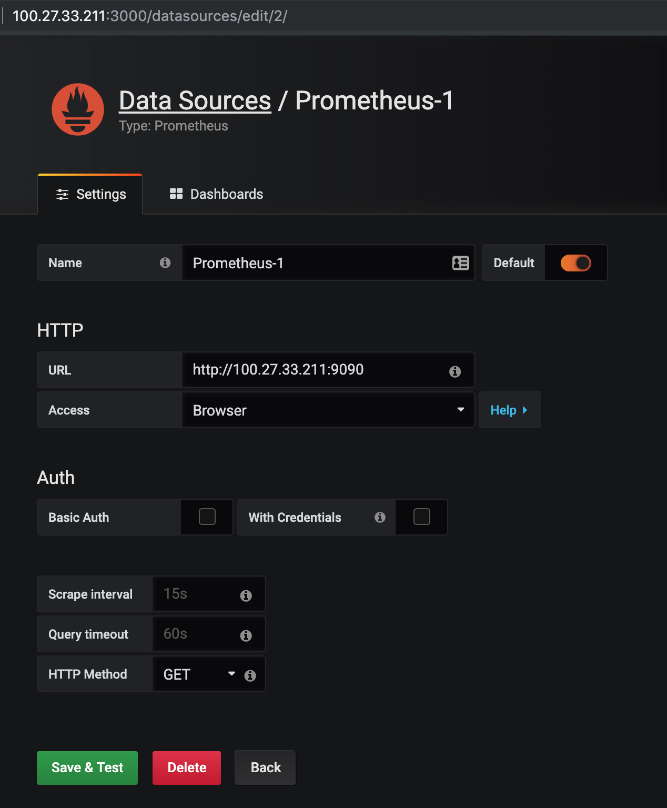

# Monitoring and Maintaining

## Kubectl tips

This will save you a lot of typing, but I've not used it in the examples below.

```
alias k=kubectl
```

#### Cheat sheet and book

Check out the official [kubectl Cheat Sheet](https://kubernetes.io/docs/reference/kubectl/cheatsheet/) which gives plenty of examples. 
Even better, brand new for Kubernetes 1.14, [kubectl has it's own gitbook](https://kubectl.docs.kubernetes.io/).

#### Get a shell in a container

Assuming you're using a container with `bash` installed

```bash
kubectl exec -ti pod-name bash
```

Alpine only has `sh` installed

```bash
kubectl exec -ti pod-name sh
```

Note that there are containers that don't even offer shells \(ones based directly on "scratch" or [Distroless](https://github.com/GoogleContainerTools/distroless)\).

#### Get a shell in a _specific_ container

To run a shell in a _specific_ container in a pod use `-c`:

```bash
kubectl exec -ti pod-name -c container-name bash
```

You can use this with any *running* container. Indeed you can also use it with an `initContainer` if it's stuck.

You can find the list of containers _viz._

```bash
kubectl get po pod-name \
  -o jsonpath="{.spec['containers','initContainers'][*].name}"
```

Here's a real example.

```text
$ kubectl get po acs-alfresco-cs-repository-577c788567-wlg5g \
  -n nic-acs-trial \
  -o jsonpath="{.spec['containers','initContainers'][*].name}"
alfresco-content-services init-db
```

#### Logs

You can get logs via

```bash
kubectl logs pod-name
```

You can also get them for pods that have been replaced by newer instances

```bash
kubectl logs pod-name --previous
```

For issues with pods, then `describe` shows any issues at the end

```bash
k describe po pod-name
```

#### Extra tools

If you're working with mutliple clusters, or with a particular namespace, then [kubectx and kubens](https://kubectx.dev) are useful.

## Three Pillars of Observability

Logs, metrics, and traces are called the three pillars of observability. The typical open source tools used for these tasks follow:

* Logs are sent to an ELK stack
* Metrics are sent to Prometheus, and visualised in Grafana
* Traces are sent to Jaeger

## Prometheus, Graphana and Alert Manager

The simplest way to get started is to use the helm chart.

The following instructions are taken from https://eksworkshop.com/monitoring/ which AWS vastly simplified yesterday (3rd April)!

```bash
kubectl create namespace prometheus
helm install stable/prometheus \
    --name prometheus \
    --namespace prometheus \
    --set alertmanager.persistentVolume.storageClass="gp2" \
    --set server.persistentVolume.storageClass="gp2"

kubectl create namespace grafana
helm install stable/grafana \
    --name grafana \
    --namespace grafana \
    --set persistence.storageClassName="gp2" \
    --set adminPassword="CHANGEME" \
    --set datasources."datasources\.yaml".apiVersion=1 \
    --set datasources."datasources\.yaml".datasources[0].name=Prometheus \
    --set datasources."datasources\.yaml".datasources[0].type=prometheus \
    --set datasources."datasources\.yaml".datasources[0].url=http://prometheus-server.prometheus.svc.cluster.local \
    --set datasources."datasources\.yaml".datasources[0].access=proxy \
    --set datasources."datasources\.yaml".datasources[0].isDefault=true \
    --set service.type=LoadBalancer
```

An alternative, [kube-prometheus package](https://github.com/coreos/prometheus-operator/tree/master/contrib/kube-prometheus) relies on understanding JSonnet to configure it.

### Port-Forwarding

The simplest way of getting to the dashboards/web interfaces of the components is to tunnel it.

On the bastion

```bash
kubectl -n prometheus port-forward svc/prometheus-server 9090 &
kubectl -n monitoring port-forward svc/prometheus-alertmanager 9093 &
```

and locally \(on macOS or Linux\)

```bash
ssh -L 9090:127.0.0.1:9090 bastion-host -N -f
ssh -L 9093:127.0.0.1:9093 bastion-host -N -f
```

Then visit [http://localhost:9090](http://localhost:9090). This isn't a production-grade way of exposing the services.

### Grafana

Grafana is already exposed as a LoadBalancer in this configuration. You can find the hostname via

```bash
kubectl get svc -n grafana grafana -o json | grep hostname  
```

#### Alfresco Content Services

ACS 6.1.0 exposes a Prometheus endpoint at `/alfresco/s/prometheus` and you can read more about it in the [acs-packaging site](https://github.com/Alfresco/acs-packaging/tree/master/docs/micrometer).

A basic configuration for Prometheus to scrape Alfresco follows:

```
  - job_name: 'alfresco'

    # Override the global default and scrape targets from this job every 5 seconds.
    scrape_interval: 5s

    static_configs:
      - targets: ['acs.nic-demo.dev.alfresco.me']
        labels:
          group: 'production'

    metrics_path: '/alfresco/s/prometheus'
    basic_auth:
      username: admin
      password: admin
```

### Prometheus: external to the cluster

Deploying external to your cluster is simple and useful while developing. You can chain prometheus instances via
[federation](https://prometheus.io/docs/prometheus/latest/federation/)
so you could even take a mix+match approach to have in-cluster prometheus instances (per cluster), federated to an external instance.

Grafana talks to Prometheus, but the configuration seems obtuse. Here's a working screenshot for grafana and prometheus installed on 
the same server, but external to the cluster. (Note that Prometheus does not provide any authentication).



#### Istio

If you use istio service mesh, it comes with Promethueus, _et al._.