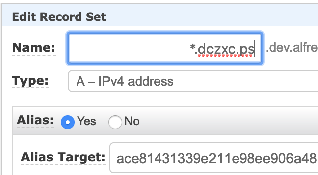

# Prerequisites

## Before you start...

### IAM Permissions

Create a new IAM Policy following permissions: 

```text
{
    "Version": "2012-10-17",
    "Statement": [
        {
            "Effect": "Allow",
            "Action": [
                "iam:CreateInstanceProfile",
                "iam:DeleteInstanceProfile",
                "iam:GetRole",
                "iam:GetInstanceProfile",
                "iam:RemoveRoleFromInstanceProfile",
                "iam:CreateRole",
                "iam:DeleteRole",
                "iam:AttachRolePolicy",
                "iam:PutRolePolicy",
                "iam:ListInstanceProfiles",
                "iam:AddRoleToInstanceProfile",
                "iam:ListInstanceProfilesForRole",
                "iam:PassRole",
                "iam:DetachRolePolicy",
                "iam:DeleteRolePolicy",
                "iam:GetRolePolicy"
            ],
            "Resource": [
                "arn:aws:iam::586394462691:instance-profile/eksctl-*",
                "arn:aws:iam::586394462691:role/eksctl-*"
            ]
        },
        {
            "Effect": "Allow",
            "Action": "cloudformation:*",
            "Resource": "*"
        },
        {
            "Effect": "Allow",
            "Action": [
                "eks:*",
                "route53:*",
                "elasticfilesystem:*",
                "ec2:*"
            ],
            "Resource": "*"
        },
        {
            "Effect": "Allow",
            "Action": [
                "autoscaling:DescribeAutoScalingGroups",
                "autoscaling:DescribeLaunchConfigurations",
                "autoscaling:DescribeScalingActivities",
                "autoscaling:CreateLaunchConfiguration",
                "autoscaling:DeleteLaunchConfiguration",
                "autoscaling:UpdateAutoScalingGroup",
                "autoscaling:DeleteAutoScalingGroup",
                "autoscaling:CreateAutoScalingGroup"
            ],
            "Resource": "*"
        }
    ]
}
```

Create a ec2 + cloudformation service account role with the previous policy and assign them to the workshop machines.

### Commands and packages preinstalled on standard AMI image

Below are the tasks already performed in your EC2 instance, **you don't have to install these packages, they are ALREADY INSTALLED**, this is informative:

#### kubectl

```text
curl -o kubectl https://amazon-eks.s3-us-west-2.amazonaws.com/1.11.5/2018-12-06/bin/linux/amd64/kubectl
chmod +x ./kubectl
sudo mv kubectl /usr/local/bin
kubectl version --short --client
```

#### eksctl

```text
curl --silent --location "https://github.com/weaveworks/eksctl/releases/download/latest_release/eksctl_$(uname -s)_amd64.tar.gz" | tar xz -C /tmp
sudo mv /tmp/eksctl /usr/local/bin
```

#### aws-iam-authenticator

```text
curl -o aws-iam-authenticator https://amazon-eks.s3-us-west-2.amazonaws.com/1.11.5/2018-12-06/bin/linux/amd64/aws-iam-authenticator
chmod +x ./aws-iam-authenticator
sudo mv aws-iam-authenticator /usr/local/bin
```

#### stern

```text
wget https://github.com/wercker/stern/releases/download/1.10.0/stern_linux_amd64
chmod +x ./stern_*
sudo mv stern_* /usr/local/bin/stern
```

#### helm

```text
curl -L https://raw.githubusercontent.com/helm/helm/master/scripts/get | sh -
helm repo update
```

#### git

```text
sudo yum -y install git
```

#### update awscli

```text
pip install awscli --upgrade
```

### SSH Access

We will provide you a SSH key and IP address to work with it. In your workstation run:

```text
chmod 600 workshop-alfresco.pem
```

Add that key to your ssh profile:

```text
ssh-add workshop-alfresco.pem
```

And access to the EC2 instance using the given IP:

```text
ssh -A ec2-user@IP
```

That EC2 instance has specific instance profile \(IAM role\) to be able to run `kubectl`.

### Quay Access

See the Anaxes Shipyard documentation on [secrets](https://github.com/Alfresco/alfresco-anaxes-shipyard/blob/master/SECRETS.md).

_Note_: You can reuse the secrets.yaml file from charts/incubator directory.

```text
cd charts/incubator
cat ~/.docker/config.json | base64
```

Add the base64 string generated to .dockerconfigjson in secrets.yaml. The file should look similar to this:

```text
apiVersion: v1
kind: Secret
metadata:
  name: quay-registry-secret
type: kubernetes.io/dockerconfigjson
data:
# Docker registries config json in base64 to do this just run - cat ~/.docker/config.json | base64
  .dockerconfigjson: ew0KCSJhdXRocyI6IHsNCgkJImh0dHBzOi8vcXVheS5pbyI6IHsNCgkJCSJhdXRoIjogImRHVnpkRHAwWlhOMD0iDQoJCX0sDQoJCSJxdWF5LmlvIjogew0KCQkJImF1dGgiOiAiZEdWemREcDBaWE4w550KCQl9DQoJfSwNCgkiSHR0cEhlYWRlcnMiOiB7DQoJCSJVc2VyLUFnZW50IjogIkRvY2tlci1DbGllbnQvMTcuMTIuMC1jZS1yYzMgKGRhcndpbikiDQoJfQ0KfQ==
```

Then run this command:

```text
kubectl create -f secrets.yaml --namespace $DESIREDNAMESPACE
```


Create your registry pull secret by using the quay.io website. 

Go to Account Settings -&gt; 



Generate an encrypted password -&gt;


Press the view k8s secret button and copy the contents of your secret. 


Afterwards get back to your ssh session, paste the content into a secret.yaml file and change the metadata.name to quay-registry-secret.

